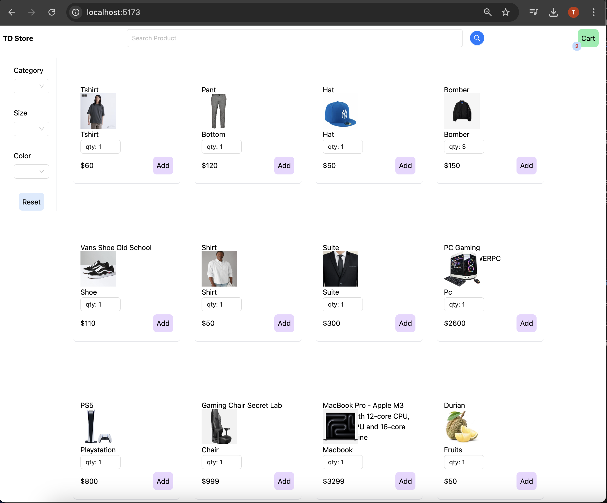
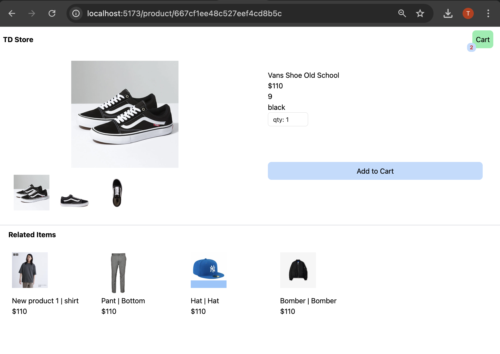
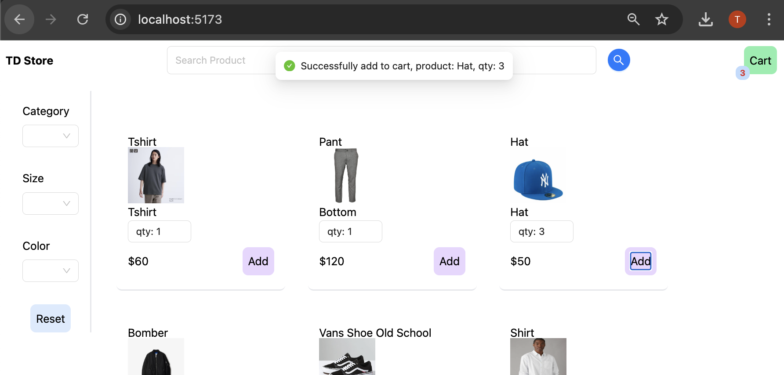
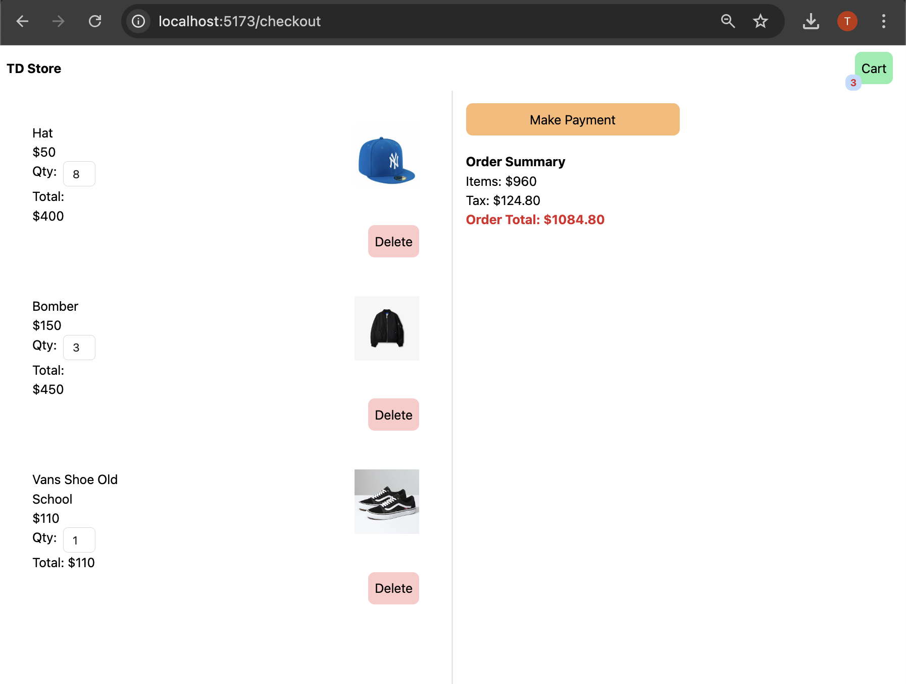
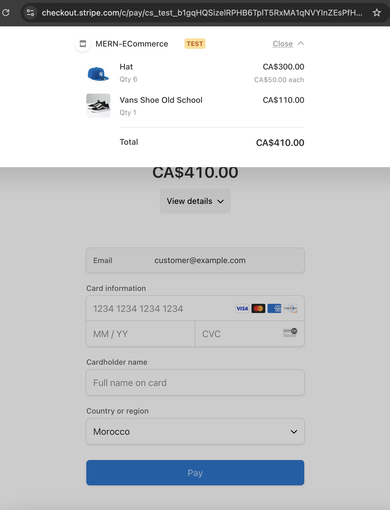
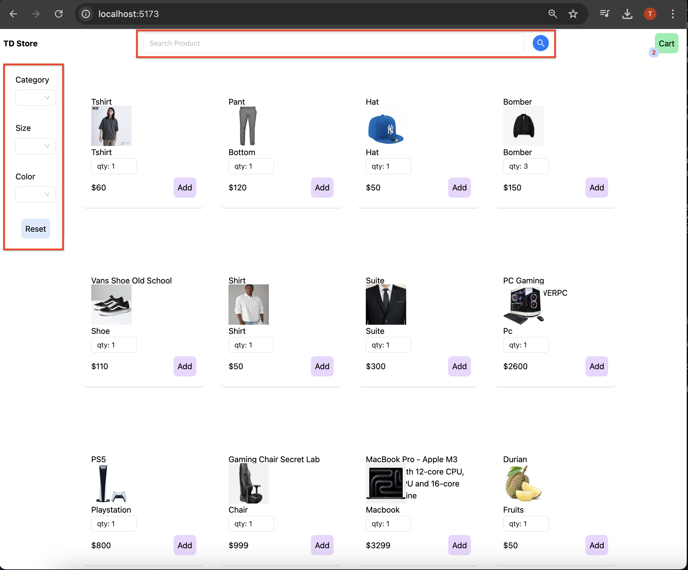
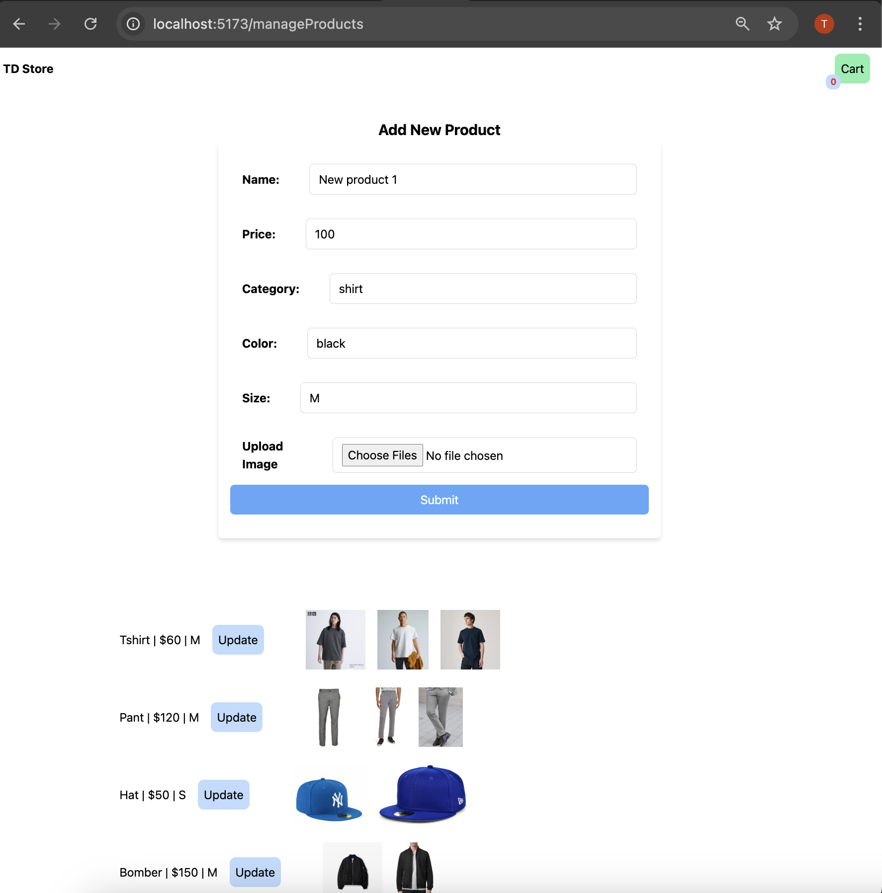
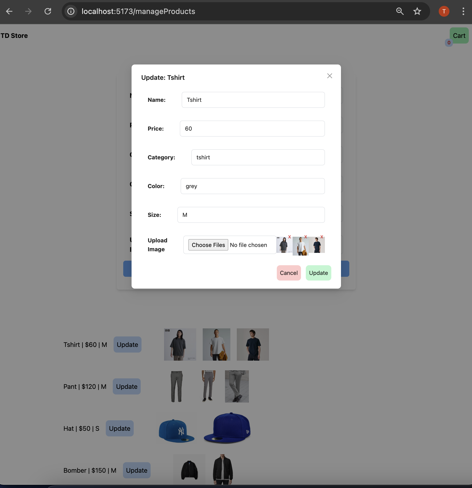
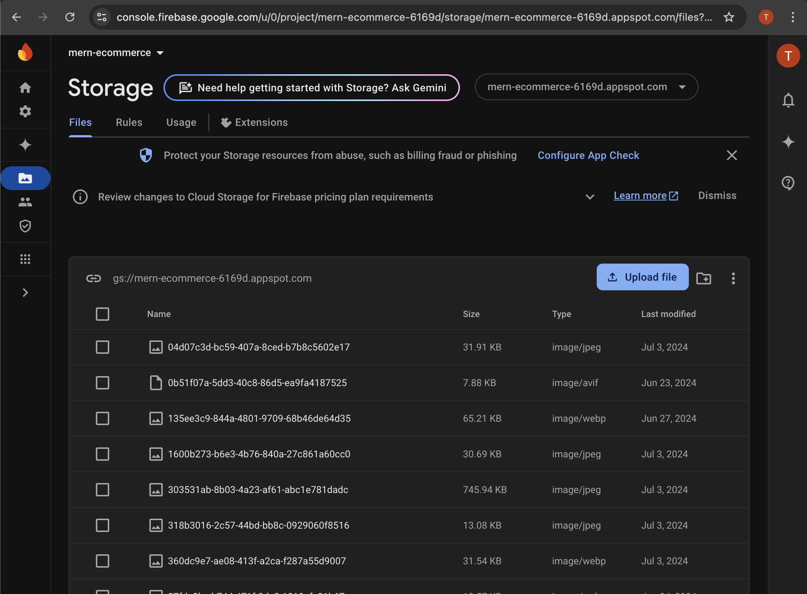

<a name="top"/>

# Table of contents

- [Local Setup](#localSetup)
- [Docker Local](#dockerLocal)


<a name="localSetup"/>

# Local Setup

### Setup

- Install [Node](https://nodejs.org/en/download/)
- Install [Git](https://git-scm.com/book/en/v2/Getting-Started-Installing-Git)
- Setup MongoDB
- Clone the repository `https://github.com/tddag/mern-ecommerce`
- Install dependencies `npm install`
- Set up Firebase [docs](https://firebase.google.com/docs/web/learn-more?hl=en&authuser=0&_gl=1*lzujr5*_ga*MjA5NjIxNDI5Ni4xNzMyMzE1NDgw*_ga_CW55HF8NVT*MTczMjMxNTQ4MC4xLjEuMTczMjMxNzAyNi4xNC4wLjA.#modular-version):
  - Navigate to [firebase](https://console.firebase.google.com/)
  - Create a new project
  - Register web app
  - Store Firebase config details such as apiKey, authDomain, projectId, storageBucket, messagingSenderId, appId
  - Ensure access is allowed by going to Storage -> Rules. ex.
  ```
    service firebase.storage {
        match /b/{bucket}/o {
            match /{allPaths=**} {
            allow read, write: if request.time < timestamp.date(2025, 7, 22);
            }
        }
    }
  ```
- Setup server environment variables (./server/.env):
  - <table>
        <tr>
            <th>Variable</th>
            <th>Value</th>
            <th>Description</th>
        </tr>
        <tr>
            <td>MONGODBURL</td>
            <td>mongodb+srv://.....</td>
            <td>MongoDB Server URL</td>
        </tr>
        <tr>
            <td>JWT_PRIVATE_KEY</td>
            <td>...</td>
            <td>Private Key for authentication, used to sign signature</td>
        </tr>        
        <tr>
            <td>STRIPE_SECRET_KEY</td>
            <td>sk_test_......</td>
            <td>Stripe Secret Key (https://docs.stripe.com/keys)td>
        </tr>   
        <tr>
            <td>FRONT_END_URL</td>
            <td>http://localhost:5173</td>
            <td></td>
        </tr>                   
    </table>
- Setup client environment variables (./client/.env):
  - <table>
        <tr>
            <th>Variable</th>
            <th>Value</th>
            <th>Description</th>
        </tr>
        <tr>
            <td>VITE_FIREBASE_APIKEY</td>
            <td>......</td>
            <td>Firebase API Key</td>
        </tr>
        <tr>
            <td>VITE_FIREBASE_AUTH_DOMAIN</td>
            <td>mern-ecommerce-6169d.firebaseapp.com</td>
            <td>Firebase Auth Domain</td>
        </tr>        
        <tr>
            <td>VITE_FIREBASE_PROJECT_ID</td>
            <td>mern-ecommerce-6169d</td>
            <td>Firebase Project IDtd>
        </tr>   
        <tr>
            <td>VITE_FIREBASE_STORAGE_BUCKET</td>
            <td>mern-ecommerce-6169d.appspot.com</td>
            <td>Firebase Storage Bucket</td>
        </tr>       
        <tr>
            <td>VITE_FIREBASE_STORAGE_MESSAGING_SENDER_ID</td>
            <td>22870......</td>
            <td>Firebase Storage Messing Sender ID</td>
        </tr>
        <tr>
            <td>VITE_FIREBASE_APP_ID</td>
            <td>1:22870408.......:web:ac07b13c......</td>
            <td>Firebase App ID</td>
        </tr>        
        <tr>
            <td>VITE_BACKEND_URL</td>
            <td>http://localhost:8000</td>
            <td>Back End URL </td>
        </tr>                    
    </table>
- Run the app `npm run start`

### Functionalities

- Product Listing
  - <table>
        <tr>
            <td></td>
        </tr>
    </table>
- Product Details, Images, Related Items
  - <table>
        <tr>
            <td></td>
        </tr>
    </table>
- Cart Functionalities - Add Item, Remove Item, Update Quantity
  - <table>
        <tr>
            <td></td>
            <td></td>
        </tr>
    </table>
- Stripe Payment
  - <table>
        <tr>
            <td></td>
        </tr>
    </table>
- Search Product, Filter Product by Category, Size, Color
  - <table>
        <tr>
            <td></td>
        </tr>
    </table>
- Admin Console - Add New Product, List all products, Update existing Products
  - <table>
        <tr>
            <td></td>
            <td></td>
        </tr>
    </table>
- Files Storage
  - <table>
        <tr>
            <td></td>
        </tr>
    </table>

### Technologies/Libraries:

- ExpressJS: BackEnd server
- ReactJS: Web App
- Mongoose: ODM (Object Data Modelling)
- MongoDB: Database
- Firebase Storage: File Storage
- Stripe: Payment API

<a name="dockerLocal"/>

# Docker Local

### Server
- create Dockerfile for server
- create server image
    - `cd server`
    - `docker build -t ecommerce-server:1.0 .`
- run server:
    - `cd server`
    - `docker run --env-file .env -d -p 8000:8000 ecommerce-server:1.0`
    - or `docker run -e MONGODBURL=<MONGODBURL> -e JWT_PRIVATE_KEY=<JWT_PRIVATE_KEY> -e STRIPE_SECRET_KEY=<STRIPE_SECRET_KEY> -e FRONT_END_URL=<FRONT_END_URL> -d -p 8000:8000 ecommerce-server:1.0`

### Client
- create Dockerfile for client
- add .dockerignore file
- create client image
    - `cd client`
    - `docker build -t ecommerce-client:1.0 .`
- run client:
    - `cd client`
    - `docker run --env-file .env -d -p 5173:5173 ecommerce-client:1.0`
    - or `docker run -e VITE_FIREBASE_APIKEY=<VITE_FIREBASE_APIKEY> -e .... -d -p 5173:5173 ecommerce-client:1.0`
- check if Nginx is running:
    - `docker exec -it e6a3621c66fc nginx -t`

### Test
 - GET `http://127.0.0.1:8000/api/products`
 - GET `http://localhost:5173/`

