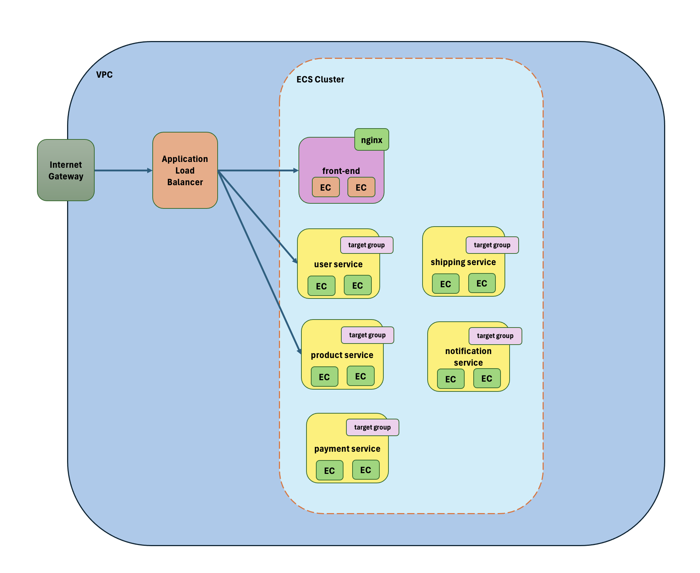

<a name="top"/>

# Table of contents

- [Local Setup](#localSetup)
- [Docker Local](#dockerLocal)
- [AWS](#aws)


<a name="localSetup"/>

# Local Setup

### Setup

- Install [Node](https://nodejs.org/en/download/)
- Install [Git](https://git-scm.com/book/en/v2/Getting-Started-Installing-Git)
- Setup MongoDB
- Clone the repository `https://github.com/tddag/mern-ecommerce`
- Install dependencies `npm install`
- Set up Firebase [docs](https://firebase.google.com/docs/web/learn-more?hl=en&authuser=0&_gl=1*lzujr5*_ga*MjA5NjIxNDI5Ni4xNzMyMzE1NDgw*_ga_CW55HF8NVT*MTczMjMxNTQ4MC4xLjEuMTczMjMxNzAyNi4xNC4wLjA.#modular-version):
  - Navigate to [firebase](https://console.firebase.google.com/)
  - Create a new project
  - Register web app
  - Store Firebase config details such as apiKey, authDomain, projectId, storageBucket, messagingSenderId, appId
  - Ensure access is allowed by going to Storage -> Rules. ex.
  ```
    service firebase.storage {
        match /b/{bucket}/o {
            match /{allPaths=**} {
            allow read, write: if request.time < timestamp.date(2025, 7, 22);
            }
        }
    }
  ```
- Setup server environment variables (./server/.env):
  - <table>
        <tr>
            <th>Variable</th>
            <th>Value</th>
            <th>Description</th>
        </tr>
        <tr>
            <td>MONGODBURL</td>
            <td>mongodb+srv://.....</td>
            <td>MongoDB Server URL</td>
        </tr>
        <tr>
            <td>JWT_PRIVATE_KEY</td>
            <td>...</td>
            <td>Private Key for authentication, used to sign signature</td>
        </tr>        
        <tr>
            <td>STRIPE_SECRET_KEY</td>
            <td>sk_test_......</td>
            <td>Stripe Secret Key (https://docs.stripe.com/keys)td>
        </tr>   
        <tr>
            <td>FRONT_END_URL</td>
            <td>http://localhost:5173</td>
            <td></td>
        </tr>                   
    </table>
- Setup client environment variables (./client/.env):
  - <table>
        <tr>
            <th>Variable</th>
            <th>Value</th>
            <th>Description</th>
        </tr>
        <tr>
            <td>VITE_FIREBASE_APIKEY</td>
            <td>......</td>
            <td>Firebase API Key</td>
        </tr>
        <tr>
            <td>VITE_FIREBASE_AUTH_DOMAIN</td>
            <td>mern-ecommerce-6169d.firebaseapp.com</td>
            <td>Firebase Auth Domain</td>
        </tr>        
        <tr>
            <td>VITE_FIREBASE_PROJECT_ID</td>
            <td>mern-ecommerce-6169d</td>
            <td>Firebase Project IDtd>
        </tr>   
        <tr>
            <td>VITE_FIREBASE_STORAGE_BUCKET</td>
            <td>mern-ecommerce-6169d.appspot.com</td>
            <td>Firebase Storage Bucket</td>
        </tr>       
        <tr>
            <td>VITE_FIREBASE_STORAGE_MESSAGING_SENDER_ID</td>
            <td>22870......</td>
            <td>Firebase Storage Messing Sender ID</td>
        </tr>
        <tr>
            <td>VITE_FIREBASE_APP_ID</td>
            <td>1:22870408.......:web:ac07b13c......</td>
            <td>Firebase App ID</td>
        </tr>        
        <tr>
            <td>VITE_BACKEND_URL</td>
            <td>http://localhost:8000</td>
            <td>Back End URL </td>
        </tr>                    
    </table>
- Run the app `npm run start`

### Functionalities

- Product Listing
  - <table>
        <tr>
            <td></td>
        </tr>
    </table>
- Product Details, Images, Related Items
  - <table>
        <tr>
            <td></td>
        </tr>
    </table>
- Cart Functionalities - Add Item, Remove Item, Update Quantity
  - <table>
        <tr>
            <td></td>
            <td></td>
        </tr>
    </table>
- Stripe Payment
  - <table>
        <tr>
            <td></td>
        </tr>
    </table>
- Search Product, Filter Product by Category, Size, Color
  - <table>
        <tr>
            <td></td>
        </tr>
    </table>
- Admin Console - Add New Product, List all products, Update existing Products
  - <table>
        <tr>
            <td></td>
            <td></td>
        </tr>
    </table>
- Files Storage
  - <table>
        <tr>
            <td></td>
        </tr>
    </table>

### Technologies/Libraries:

- ExpressJS: BackEnd server
- ReactJS: Web App
- Mongoose: ODM (Object Data Modelling)
- MongoDB: Database
- Firebase Storage: File Storage
- Stripe: Payment API

<a name="dockerLocal"/>

# Docker Local

### Server
- create Dockerfile for server
- create server image
    - `cd server`
    - `docker build -t ecommerce-server:1.0 .`
- run server:
    - `cd server`
    - `docker run --env-file .env -d -p 8000:8000 ecommerce-server:1.0`
    - or `docker run -e MONGODBURL=<MONGODBURL> -e JWT_PRIVATE_KEY=<JWT_PRIVATE_KEY> -e STRIPE_SECRET_KEY=<STRIPE_SECRET_KEY> -e FRONT_END_URL=<FRONT_END_URL> -d -p 8000:8000 ecommerce-server:1.0`

### Client
- create Dockerfile for client
- add .dockerignore file
- create client image
    - `cd client`
    - `docker build -t ecommerce-client:1.0 .`
- run client:
    - `cd client`
    - `docker run --env-file .env -d -p 80:80 ecommerce-client:1.0`
    - or `docker run -e VITE_FIREBASE_APIKEY=<VITE_FIREBASE_APIKEY> -e .... -d -p 80:80 ecommerce-client:1.0`
    - or `docker run -d -p 80:80 ecommerce-client:1.0`
- check if Nginx is running:
    - `docker exec -it e6a3621c66fc nginx -t`

### Test
 - GET `http://127.0.0.1:8000/api/products`
 - GET `http://localhost` or `http://localhost:80`


<a name="localSetup"/>

# AWS

### Diagram
    - 
        <table>
            <tr>
                <td></td>
            </tr>
        </table>


### Docker Hub

- [Docker Hub](https://hub.docker.com/)
- Ecommerce - Server
    - click "Create a repository"
        - "Namespace": "tddag"
        - "Repository Name": "ecommerce-server"
        - check "Public"
        - click "Create"
    - tag local image with remote
    - `docker tag ecommerce-server:1.0 tddag/ecommerce-server:1.0`
    - push image to remote
    - `docker push tddag/ecommerce-server:1.0`
- Ecommerce - Client
    - click "Create a repository"
        - "Namespace": "tddag"
        - "Repository Name": "ecommerce-client"
        - check "Public"
        - click "Create"
    - tag local image with remote
    - `docker tag ecommerce-client:1.0 tddag/ecommerce-client:1.0`
    - push image to remote
    - `docker push tddag/ecommerce-client:1.0`

[Top](#top)


### AWS ECS

##### 1. VPC

- "VPC"
- use default VPC

##### 2. Subnet

- "VPC" -> "Subnet"
- use default subnets

##### 3. Internet Gateway

- "VPC" -> "Internet Gateways"
- use default Internet Gateway for VPC

##### 4. Key Pairs

- "EC2" -> "Key Pairs"
- create a key pair and store private .pem file

##### 5. Security Group

- "EC2" -> "Security Groups"
- Ecommerce - Server
    - create a new security group for Ecommerce - Server
        - "name": "ecommerce-server-sg"
        - "VPC":
        - "Inbound Rules":
            - "All Traffic" - "All" - "172.31.0.0/16"
        - "Outbound Rules":
            - "All traffic" - "All" - "Anywhere IPv4"        

- Ecommerce - Load Balancer
    - create a new security group for Ecommerce - Load Balancer
        - "name": "ecommerce-load-balancer-sg"
        - "VPC":
        - "Inbound Rules":
            - "Custom TCP" - "8000" - "0.0.0.0/0"
            - "Custom TCP" - "80" - "0.0.0.0/0"


- Ecommerce - Client
    - create a new security group for Ecommerce - Client
        - "name": "ecommerce-client-sg"
        - "VPC":
        - "Inbound Rules":
            - "All Traffic" - "All" - "172.31.0.0/16"
        - "Outbound Rules":
            - "All traffic" - "All" - "Anywhere IPv4"          

##### 6. Target Group

- "EC2" -> "Target Group"
- Ecommerce - Server
    - "Target Type": "IP addresses"
    - "name": "ecommerce-server-target-group"
    - "Protocol": "HTTP 8000"
    - "IP Address Type": "IPv4"
    - "VPC": default VPC
    - click "Next"
    - click "Create Target Group"
- Ecommerce - Client
    - "Target Type": "IP addresses"
    - "name": "ecommerce-client-target-group"
    - "Protocol": "HTTP 80"
    - "IP Address Type": "IPv4"
    - "VPC": default VPC
    - click "Next"
    - click "Create Target Group"    

##### 7. Application Load Balancer

- "EC2" -> "Load Balancer"
- "Create load balancer"
    - "Type": "Application Load Balancer"
    - "name": "ecommerce-load-balancer"
    - "Schema": "Internet-facing"
    - "VPC": default VPC
    - "Subnet":
    - "Security Group": "ecommerce-load-balancer-sg"
    - "Listeners and routing":
        - "HTTP 8000": "Forward to target group ecommerce-server-target-group"
        - "HTTP 80": "Forward to target group ecommerce-client-target-group"
    - click "Create load balancer"

##### 8. Task Definition

- "ECS" -> "Task Definitions"
- Ecommerce - Server
  - "Family Name": "ecommerce-server-task-definition"
  - "Launch Type": "AWS Fargate"
  - "Operating System": "Linux/X86_64"
  - "Network mode": "awsvpc"
  - "Task size": "0.25 CPU 0.5 GB RAM"
  - "Task role": "ecsTaskExecutionRole"
  - "Task execution role": "ecsTaskExecutionRole"
  - "Container - 1":
    - "Name": "ecommerce-server-service"
    - "Image URI": "docker.io/tddag/ecommerce-server:1.0"
    - "Essential Container": "Yes"
    - "Port Mapping":
      - "Container port": "8000"
      - "Protocol": "TCP"
      - "App Protocol": "HTTP"
      - "Environment variables":
        - "MONGODBURL" = "mongodb+srv://tamuser:<pw>@tdmerncluster.5ectioe.mongodb.net/?retryWrites=true&w=majority&appName=TDMERNCluster" 
        - "JWT_PRIVATE_KEY" = "..."
        - "STRIPE_SECRET_KEY" = "sk_test_5..."
        - "FRONT_END_URL"  = "<to_update>"

- Ecommerce - Client
  - "Family Name": "ecommerce-client-task-definition"
  - "Launch Type": "AWS Fargate"
  - "Operating System": "Linux/X86_64"
  - "Network mode": "awsvpc"
  - "Task size": "0.25 CPU 0.5 GB RAM"
  - "Task role": "ecsTaskExecutionRole"
  - "Task execution role": "ecsTaskExecutionRole"
  - "Container - 1":
    - "Name": "ecommerce-client-service"
    - "Image URI": "docker.io/tddag/ecommerce-client:1.0"
    - "Essential Container": "Yes"
    - "Port Mapping":
      - "Container port": "80"
      - "Protocol": "TCP"
      - "App Protocol": "HTTP"
      - "Environment variables":
        - Note: These environment variables actually were generated during Docker Image build so might need to update VITE_BACKEND_URL and generate new Docker image and push to Docker hub
        - VITE_FIREBASE_APIKEY="AIzaSy...."
        - VITE_FIREBASE_AUTH_DOMAIN=mern-ecommerce-6169d.firebaseapp.com
        - VITE_FIREBASE_PROJECT_ID=mern-ecommerce-6169d
        - VITE_FIREBASE_STORAGE_BUCKET=mern-ecommerce-6169d.appspot.com
        - VITE_FIREBASE_STORAGE_MESSAGING_SENDER_ID=228704083076
        - VITE_FIREBASE_APP_ID=1:228704083076:web:ac07b13c9630d56d3836d1
        - VITE_BACKEND_URL=http://ecommerce-load-balancer-1355771122.us-east-1.elb.amazonaws.com:8000

##### 9. ECS Cluster

- "ECS" -> "Clusters"
- "Create cluster"
    - "name": "ecommerce-cluster"
    - "Infrastructure": "AWS Fargate (serverless)"
    - click "Create"

##### 10. ECS Services

- "ECS" -> "Clusters"
- open the cluster
- Ecommerce - Server
    - select "Services" tab, click "Create"
        - “Compute Options”: “Capacity provider strategy”
        - “Capacity provider”: “Fargate”
        - "Task Definition": "ecommerce-server-task-definition"
        - "Service Name": "ecommerce-server-service"
        - "Desired Tasks": 2
        - "Networking":
        - "VPC": default VPC
        - "Subnets": 
        - "Security Group": "ecommerce-server-sg"
        - "Load balancing":
            - check "Use load balancing"
            - "Load balancer type": "Application Load Balancer"
            - "Container": "ecommerce-server-service 8000:8000"
            - check "Use an existing load balancer"
                - "Load balancer": "ecommerce-load-balancer"
            - "Listener":
                - check "Use an existing listener"
                - "Listener": "8000:HTTP"
            - "Target group":
                - check "Use an existing target group"
                - "Target group name": "ecommerce-server-target-group"
    - click "Create"    

- Ecommerce - Client
    - select "Services" tab, click "Create"
        - “Compute Options”: “Capacity provider strategy”
        - “Capacity provider”: “Fargate”
        - "Task Definition": "ecommerce-client-task-definition"
        - "Service Name": "ecommerce-client-service"
        - "Desired Tasks": 2
        - "Networking":
        - "VPC": default VPC
        - "Subnets": 
        - "Security Group": "ecommerce-client-sg"
        - "Load balancing":
            - check "Use load balancing"
            - "Load balancer type": "Application Load Balancer"
            - "Container": "ecommerce-client-service 80:80"
            - check "Use an existing load balancer"
                - "Load balancer": "ecommerce-load-balancer"
            - "Listener":
                - check "Use an existing listener"
                - "Listener": "80:HTTP"
            - "Target group":
                - check "Use an existing target group"
                - "Target group name": "ecommerce-client-target-group"
    - click "Create"        

##### 11. Get Application Load Balancer public IP address

- "ECS" -> "Clusters"
- open the cluster
- select "Services" tab
- open the "ecommerce-server-service" service
- click "Configuration and networking" tab
- copy the address in the "DNS names" field
    ex: `ecommerce-load-balancer-1355771122.us-east-1.elb.amazonaws.com`

##### 12. Test
- GET `ecommerce-load-balancer-1355771122.us-east-1.elb.amazonaws.com:8000/api/products`
- GET `ecommerce-load-balancer-1355771122.us-east-1.elb.amazonaws.com` or `ecommerce-load-balancer-1355771122.us-east-1.elb.amazonaws.com:80`
